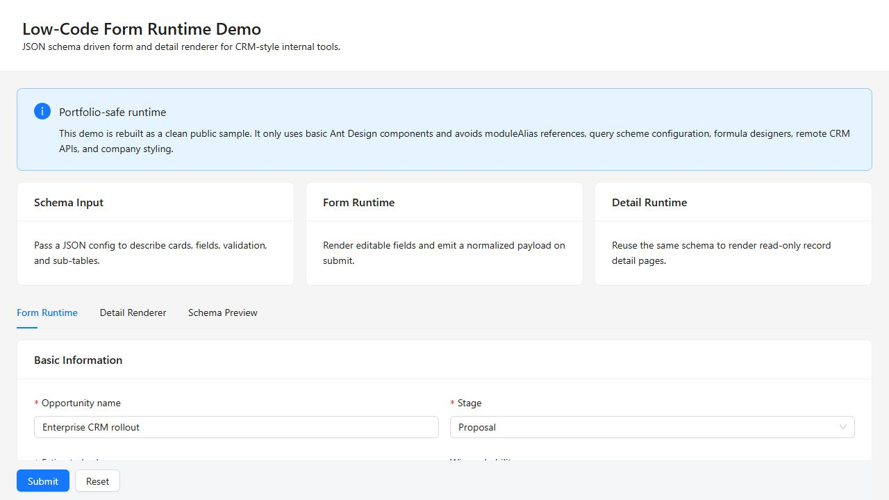
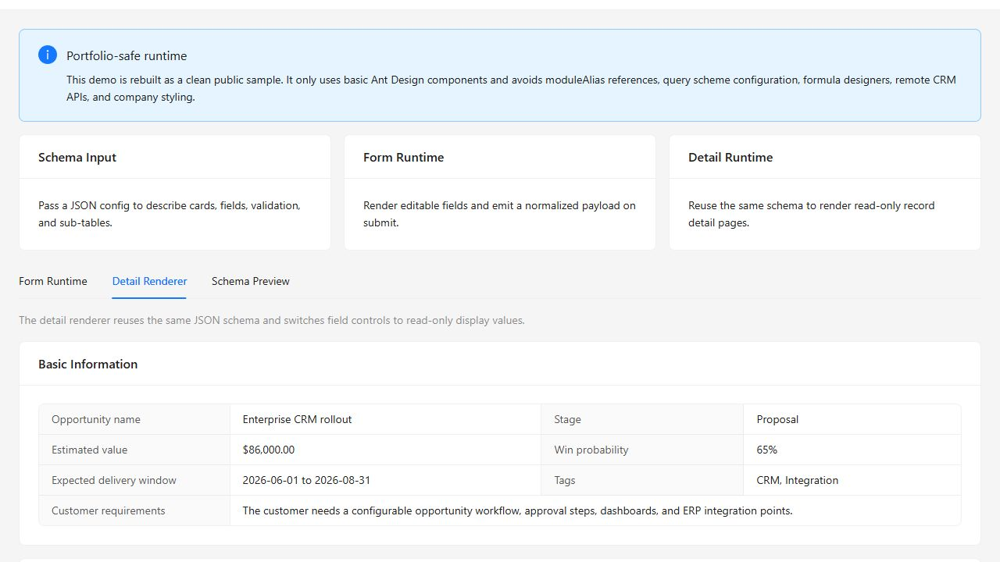

# Low-Code Form Runtime Demo

A public-safe React demo for rendering CRM-style forms and detail pages from a JSON schema.

Live Demo: https://lowcode-form-runtime-demo.vercel.app/

This project was rebuilt as a clean portfolio sample. It uses basic Ant Design components only and does not include company UI styles, production API endpoints, proprietary business data, query scheme configuration, formula designers, or module-specific runtime dependencies.

## Screenshots





## Features

- JSON schema driven cards, fields, validation, and editable sub-tables
- Editable form runtime with normalized submit payload
- Read-only detail renderer using the same schema
- Live schema and payload preview
- Ref-based runtime API for submit, reset, validation, value reads, and value writes
- Component-owned field state that avoids mirroring every field change into parent React state
- Memoized section/table rendering to reduce unnecessary updates in large forms
- Autonomous field components that can be extended without changing the page-level renderer
- Editable sub-tables with automatic stable primary key generation for new rows
- Basic field support: text, textarea, number, amount, percentage, select, multiple select, checkbox, switch, radio, date, date range, and table rows
- Portfolio-friendly CRM sample data in English

## Runtime Highlights

This demo is designed around the kind of problems that appear in large CRM and low-code forms:

- **High-performance form interaction**: field values stay inside Ant Design Form's internal store during editing, so the parent page does not need to re-render on every keystroke.
- **Ref-oriented control mode**: callers can use a component ref to submit, validate, reset, read values, or patch values without turning the entire form into parent-controlled React state.
- **Component autonomy**: each field type owns its rendering and display behavior through the field runtime layer, making new simple field types easy to add.
- **Large-node friendliness**: sections and table column definitions are memoized, which keeps repeated form blocks steadier when the schema grows.
- **Stable dynamic rows**: table sections can define a `rowKey`, and newly added rows receive a generated primary key automatically.

## Tech Stack

- React 18
- Vite
- Ant Design 5

## Getting Started

```bash
yarn install
yarn dev
```

Build for production:

```bash
yarn build
```

## Example Usage

```jsx
import { useRef, useState } from 'react'
import DynamicForm from './components/DynamicForm.jsx'
import DynamicDetail from './components/DynamicDetail.jsx'
import { formSchema, initialRecord } from './schema/sampleSchema.js'

function Demo() {
  const formRef = useRef(null)
  const [record, setRecord] = useState(initialRecord)

  return (
    <>
      <DynamicForm
        ref={formRef}
        schema={formSchema}
        value={record}
        onSubmit={setRecord}
      />
      <DynamicDetail schema={formSchema} value={record} />
    </>
  )
}
```

## Schema Shape

The schema is intentionally small and easy to read:

```js
{
  title: 'Opportunity Form',
  sections: [
    {
      type: 'card',
      title: 'Basic Information',
      columns: 2,
      fields: [
        { name: 'customerName', label: 'Customer Name', type: 'text', required: true }
      ]
    },
    {
      type: 'table',
      name: 'milestones',
      title: 'Implementation Milestones',
      columns: [
        { name: 'name', label: 'Milestone', type: 'text', required: true }
      ]
    }
  ]
}
```

## Public Demo Scope

This demo focuses on simple reusable runtime behavior. Complex production features are intentionally excluded so the repository stays clean, understandable, and safe to publish.
